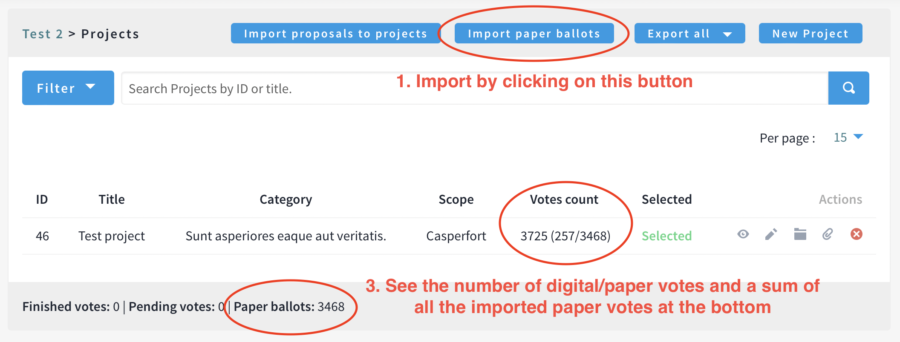
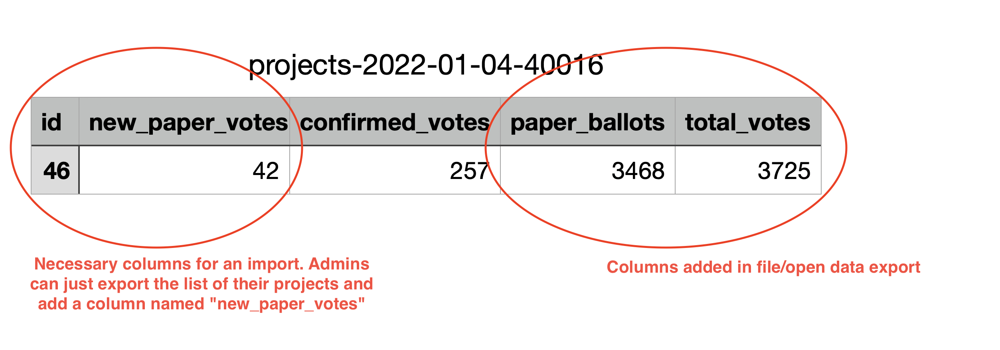

# Decidim::BudgetsPaperBallots

This module allows an admin to import paper ballots in a participatory budgeting vote.

The import process can be repeated as many times as desired, or done at once. It isn't possible to edit a value that was wrongly imported, but it is possible to import a negative number of votes to apply a correction.

The number of paper votes for each project can then be seen in the admin panel and the aggregated number of votes for each project (both paper and online) can be seen on the frontend. These values are also made available in the various data exports (from the admin panel, the open data and the API).



## Usage

The imported votes need to be provided for each project in the Budget, using a CSV or Excel files with the following columns: *id* (of the projects), *paper_votes* (number of votes to be imported), or a JSON file with an array of objects with the same keys.



An easy way to fill in such a file is to export the list of projects from the admin panel and to add a column called *paper_votes*. The remaining columns will not be read but can be left in the file.

...

## Installation

1. Add this line to your application's Gemfile:

```ruby
gem "decidim-budgets_paper_ballots", git: "https://github.com/digidemlab/decidim-module-budgets_paper_ballots"
```

And then execute:

```bash
bundle
bundle exec rails decidim_budgets_paper_ballots:install:migrations
bundle exec rails db:migrate
```

## Contributing

Create an issue or a PR if you want to suggest an improvement. Keep in mind I'd like to keep this module lightweight and simple to maintain.

## License

This module is distributed under the GNU AFFERO GENERAL PUBLIC LICENSE.
